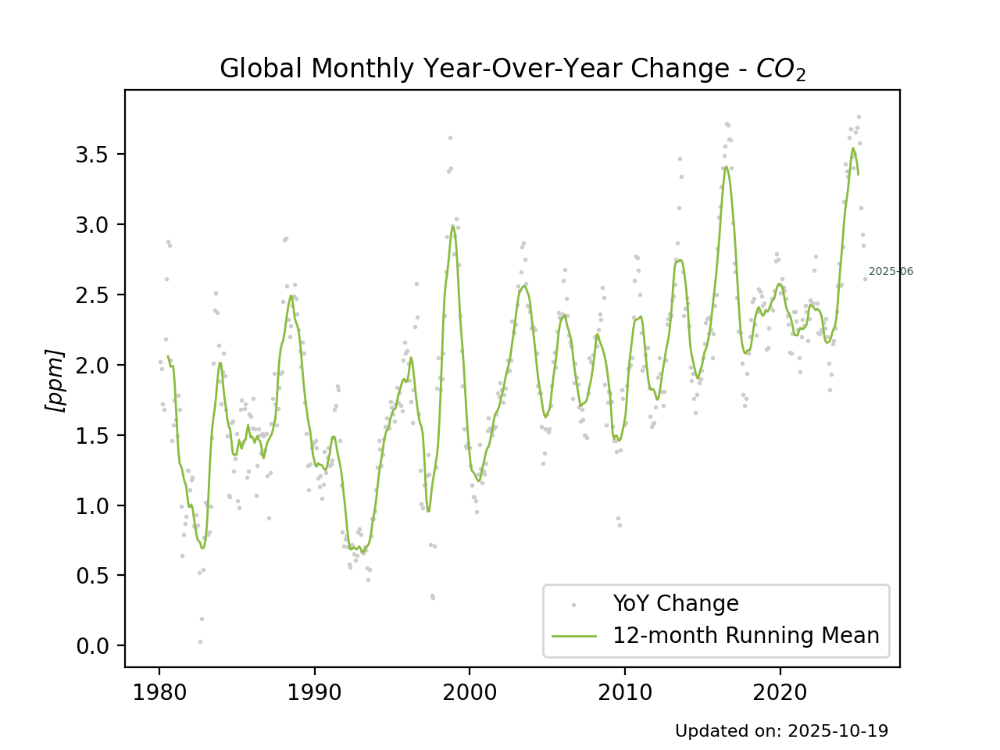
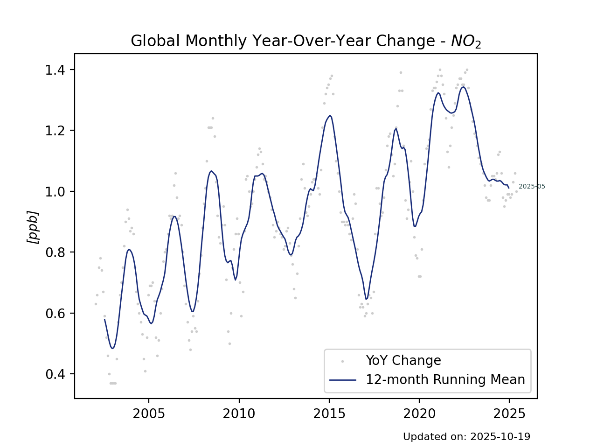
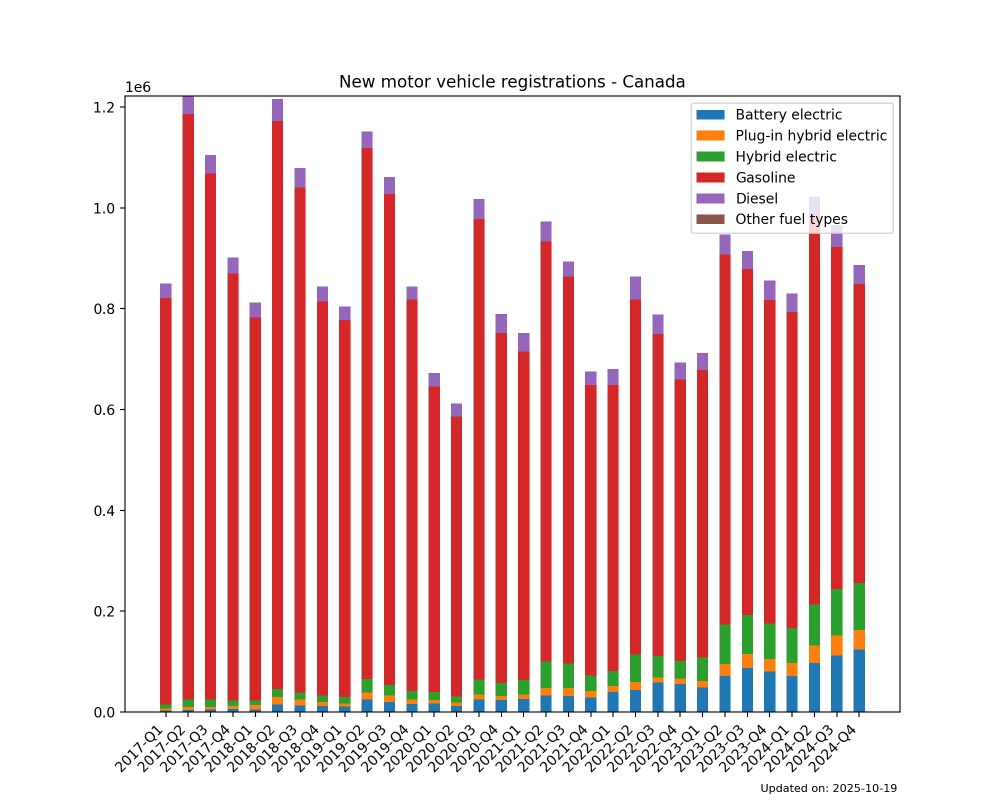
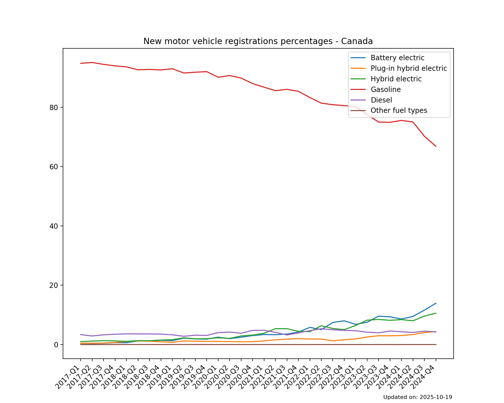
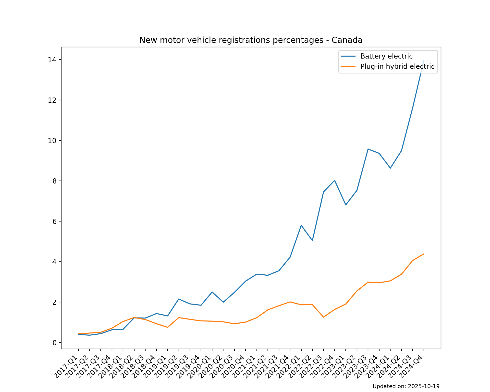

# transition-trends-canada

# Dev

`poetry run python make_ghg_plots.py`

`poetry run python make_ev_registration_plots.py`

# Global Greenhouse Gases

## CO2

## CH4

## NO2

# Canadian New Vehicle Registrations

## Canada

